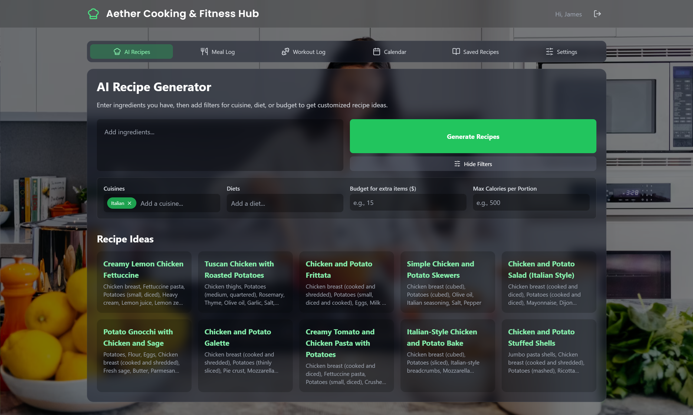

<p align="center">
  
</p>

<h1 align="center">Aether Cooking & Fitness Hub</h1>

<p align="center">
  <strong>The Ultimate AI-Powered Wellness Ecosystem for Personalized Nutrition and Fitness.</strong>
</p>

---

## A New Era of Personal Wellness

Welcome to Aether, a revolutionary full-stack application that redefines the boundaries between nutrition and fitness. Aether is not just an app; it is your all-in-one personal wellness assistant, leveraging state-of-the-art Artificial Intelligence to create a deeply personalized health journey that adapts to your unique body, lifestyle, and goals.

Our mission is to empower you with a single, intuitive platform that seamlessly integrates the two pillars of well-being: what you eat and how you move. By bridging the gap between the kitchen and the gym, Aether offers an unparalleled suite of tools. From generating bespoke recipes based on ingredients you already own to creating tailored workout plans that match your fitness level and available equipment, Aether is the definitive tool for modern, holistic living.

---

## Key Features: A Unified Approach to Health

Aether's power lies in its two perfectly integrated core suites, supported by a robust set of tracking and social tools.

### 🍏 The Culinary Suite: Your Personal AI Chef

* **Intelligent Recipe Generation:** Eradicate food waste and culinary boredom. Simply input the ingredients you have, and our AI will instantly generate a list of creative, delicious recipes.
* **Advanced Culinary Filtering:** Go beyond ingredients. Filter by a vast selection of **diets** (Vegan, Keto, Paleo), global **cuisines** (Italian, Mexican, Thai), **nutritional targets** (e.g., max 500 calories), and even a **budget** for supplemental items.
* **Community-Driven Cookbook:** Save your favorite recipes to a personal collection. Rate and comment on recipes to share your experiences and discover community-vetted favorites.

### 💪 The Fitness Suite: Your Personal AI Trainer

* **Dynamic Workout Generation:** Achieve your fitness goals with workout plans tailored to you. Specify your **target body parts** (e.g., Legs, Back, Full Body) and let our AI build a comprehensive routine.
* **Hyper-Personalized Filtering:** Your workout, your rules. Filter by **difficulty** (Easy, Medium, Hard), **workout length** (from 15 to 90+ minutes), and a vast library of **available equipment**—from bodyweight-only to a fully-stocked gym.
* **Video-Guided Exercises:** Never guess at proper form again. Many exercises in your generated plans come with links to video tutorials, ensuring you can perform each movement safely and effectively.
* **Community-Powered Fitness Library:** Just like recipes, you can save, rate, and comment on your favorite workouts, creating a living library of effective routines tried and tested by the Aether community.

### 📈 Integrated Health & Analytics Tools

* **Comprehensive Daily Logging:** Effortlessly log every meal and workout. Our AI-assisted input helps estimate caloric intake and expenditure, giving you a clear picture of your day.
* **Biometric-Enhanced AI:** In your profile, enter your age, height, and weight to calculate your BMI. The Aether AI uses this data to further personalize recipe and workout suggestions, aligning them with your unique body composition and goals.
* **Visual Progress Journals:** Track your journey by uploading photos of your meals and fitness progress directly to your daily log.
* **Interactive Calendar & History:** Review your journey with an at-a-glance calendar view summarizing your daily stats. Click on any day for a complete breakdown of logs, notes, and photos.

---

## Technology Stack & Architecture

Aether is a full-stack MERN application built with a modern, robust, and scalable technology stack. The architecture features a decoupled frontend and backend, communicating via a RESTful API.

### Backend (Server-Side)

* **Runtime Environment:** **Node.js** with **ES Modules**.
* **Framework:** **Express.js** for building the RESTful API, routing, and middleware.
* **Database:** **MongoDB** with **Mongoose** as the ODM.
* **Authentication:** **JSON Web Tokens (JWT)** for stateless sessions and **bcryptjs** for password hashing.
* **AI Integration:** Core intelligence is powered by the **Google Generative AI (Gemini) SDK**.
* **Image Storage:** **Multer** for file processing and **Cloudinary** for cloud-based image hosting.
* **Middleware:** **CORS**, custom authentication middleware, and **dotenv** for environment variables.

### Frontend (Client-Side)

* **Core Framework:** **React.js (v18+)** utilizing Hooks (`useState`, `useEffect`, `useCallback`) for state management.
* **Styling:** A sleek, responsive, and modern interface built with **Tailwind CSS**.
* **API Communication:** **Axios** for all asynchronous API requests.
* **UI Components & Icons:** Crisp and consistent icons provided by the **Lucide React** library.
* **Data Export:** Client-side data export to `.pdf` and `.txt` formats using **jsPDF**.

---

## Getting Started

To get Aether running on your local machine, follow these steps.

### Prerequisites

* **Node.js** (v18 or later recommended)
* **npm** (or yarn)
* **MongoDB Connection String** (from a local instance or a provider like MongoDB Atlas)
* **API Keys:**
    * Cloudinary Account (`API Key`, `API Secret`, `Cloud Name`)
    * Google AI API Key (for Gemini)

### Installation & Setup

1.  **Clone the repository:**
    ```sh
    git clone <repository-url>
    cd <project-directory>
    ```

2.  **Setup Backend:**
    * Navigate to the server directory: `cd server`
    * Install backend dependencies: `npm install`
    * Create a `.env` file in the `server` directory and add the following variables:
        ```env
        PORT=5001
        MONGO_URI=your_mongodb_connection_string
        JWT_SECRET=your_super_secret_jwt_key
        GEMINI_API_KEY=your_google_ai_api_key

        CLOUDINARY_CLOUD_NAME=your_cloudinary_cloud_name
        CLOUDINARY_API_KEY=your_cloudinary_api_key
        CLOUDINARY_API_SECRET=your_cloudinary_api_secret
        ```

3.  **Setup Frontend:**
    * Navigate to the client/frontend directory: `cd client` (or your frontend folder name)
    * Install frontend dependencies: `npm install`

4.  **Running the Application:**
    * **Start the Backend Server:** From the `server` directory, run:
        ```sh
        npm run dev
        ```
    * **Start the Frontend Server:** Open a *second* terminal in the `client` directory and run:
        ```sh
        npm run dev
        ```
    * Access the application at the URL provided by the frontend development server (e.g., `http://localhost:5173`).

You now have a fully functional local instance of the Aether Cooking & Fitness Hub.
